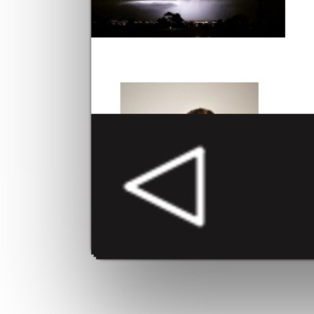
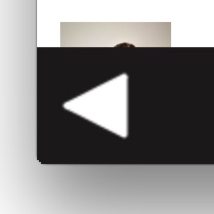

# qml-triangle
how to make a triangle button in qml

see the example-use.qml 
you can make it fill up the inside, or leave it as outline only.
Or have it filled in when the button gets pushed.

rather large screenshot follows:

 
